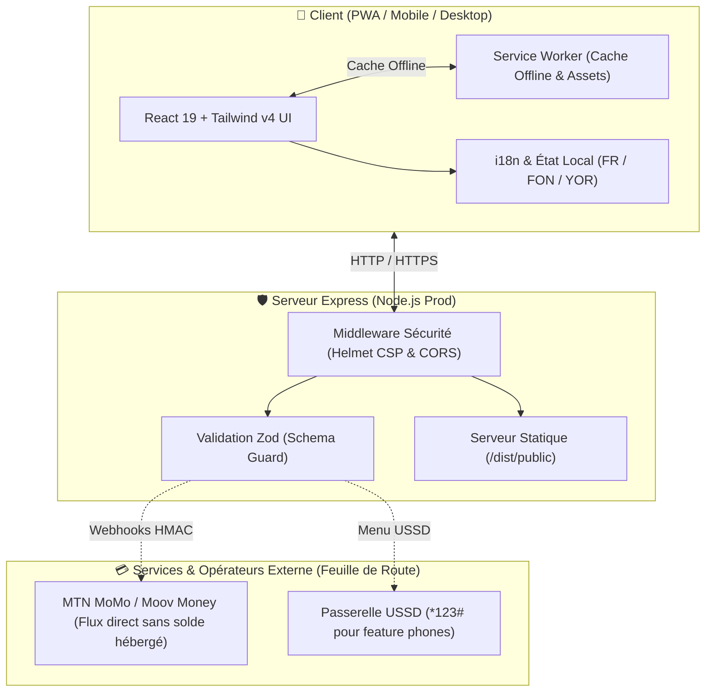

# 🇧🇯 TontineBJ — La Tontine Numérique de Confiance

[](./package.json)
[](https://react.dev/)
[](https://www.typescriptlang.org/)
[](https://vitejs.dev/)
[](https://tailwindcss.com/)
[](./client/public/manifest.webmanifest)
[](./package.json)

**TontineBJ** est une interface web moderne et une Application Web Progressive (PWA) conçue pour digitaliser et sécuriser la gestion des tontines au Bénin.

> **Zone de lancement affichée dans l'interface :** Parakou 🇧🇯

---

## 📌 1. Présentation Générale

TontineBJ est actuellement une **interface web de présentation et de démonstration** pour une future plateforme de tontines numériques. Elle présente le parcours d’un groupe, les échéances, les contributions, les statuts de confirmation et les principes de sécurité financière.

La version livrée est un **prototype frontend**. Elle ne connecte pas encore de compte utilisateur, de base de données, de service Mobile Money, de système USSD ou de paiement réel. Les actions de démonstration modifient uniquement l’état local de la page.

> **Important :** Le bouton *« Simuler une contribution »* augmente localement le montant affiché dans la démo mobile mais ne déclenche aucun débit réel et ne représente pas une transaction financière réelle.

---

## 🛠️ 2. Stack Technique & Technologies Utilisées

| Domaine | Technologie | Rôle |
|---|---|---|
| **Interface** | React 19 + TypeScript | Composition des écrans et gestion d’état locale typée |
| **Bundling** | Vite 7 + `@tailwindcss/vite` | Serveur de développement, HMR rapide et build optimisé |
| **Styles** | Tailwind CSS 4 + CSS personnalisé | Tokens de design system, responsive et direction artistique |
| **Composants** | Radix UI / shadcn/ui | Boutons, thèmes, dialogues et primitives accessibles |
| **Icônes** | Lucide React | Icônes d’interface et de navigation |
| **Notifications** | Sonner | Feedback des actions de démonstration |
| **PWA** | Manifest Web App + Service Worker natif | Installation et cache hors-ligne de la coquille applicative |
| **Serveur Prod** | Node.js + Express | Serveur statique sécurisé (Helmet CSP, CORS restreint) |
| **Tests** | Vitest + Coverage V8 | Tests unitaires des fonctions partagées |

---

## 🌟 3. Fonctionnalités Présentes

### 3.1 Page d’accueil
* Barre d’annonce locale Parakou.
* En-tête de navigation responsive avec menu rétractable.
* Hero éditorial avec illustration et ruban de parcours en 4 étapes (`01 Rejoindre` · `02 Suivre` · `03 Confirmer` · `04 Inviter`).
* Démonstration interactive de tableau de bord mobile.
* Section des groupes actifs (*Famille Houédo*, *Cercle Akpakpa*, *Les entrepreneures*).
* Principes de sécurité financière et formulaire de liste d’attente.

### 3.2 Démonstration de contribution
Le bouton **« Simuler une contribution »** augmente localement le montant affiché dans le téléphone de démonstration (+8 500 XOF) et déclenche une notification Sonner.

### 3.3 Liste d’attente
Formulaire d'inscription avec validation RFC d'adresse e-mail. Après confirmation, un état local enregistré s'affiche sans envoi de données externes.

### 3.4 Support Multi-Langue (FR / FON / YOR)
Le sélecteur d'en-tête permet de basculer l'interface en temps réel entre :
* 🇫🇷 **Français** (`fr`)
* 🇧🇯 **Fon** (`fon`)
* 🇧🇯 **Yoruba** (`yor`)

---

## 📱 4. Fonctionnalités PWA & Installation

La plateforme peut être installée comme une application native sur smartphone et ordinateur.

| Élément | Fichier Source | Fonction |
|---|---|---|
| **Manifest** | `client/public/manifest.webmanifest` | Configuration du nom, icônes, thème `#1e5b47` et mode `standalone` |
| **Icône vectorielle** | `client/public/icon.svg` | Fallback vectoriel pour favicon et affichage haute résolution |
| **Service Worker** | `client/public/service-worker.js` | Mise en cache de la coquille applicative pour accès hors-ligne |
| **Enregistrement** | `client/src/main.tsx` | Activation automatique du Service Worker au chargement |
| **Bouton Install** | `client/src/pages/Home.tsx` | Gestion de l'événement `beforeinstallprompt` |

### Installation sur Android (Chrome)
Ouvrez le site en HTTPS ou `localhost`, puis cliquez sur le bouton **Installer** dans l'en-tête, ou via le menu `⋮` > *« Ajouter à l’écran d’accueil »*.

### Installation sur iPhone (Safari)
Cliquez sur le bouton **Partager** dans Safari, puis choisissez *« Sur l’écran d’accueil »*.

### Fonctionnement hors-ligne
Le Service Worker met en cache la coquille applicative (HTML, CSS, JS, icônes). La page d'accueil reste consultable sans connexion Internet après un premier chargement.

---

## 🏗️ 5. Architecture Technique Simplifiée



---

## 📂 6. Structure des Fichiers

```text
tontinebj-web/
├── client/                     # Application Frontend React
│   ├── index.html              # Métadonnées HTML, polices & manifest PWA
│   ├── public/                 # Assets statiques publics
│   │   ├── manifest.webmanifest# Configuration PWA
│   │   ├── service-worker.js   # Service worker de cache hors-ligne
│   │   └── icon.svg            # Icône vectorielle
│   └── src/
│       ├── App.tsx             # Racine React & providers
│       ├── main.tsx            # Montage React & enregistrement PWA
│       ├── index.css           # Design system & tokens CSS
│       ├── pages/              # Pages (Home.tsx, NotFound.tsx)
│       ├── components/         # Composants UI partagés & Map.tsx
│       ├── contexts/           # Contexte de thème
│       └── lib/                # Fonctions utilitaires
├── server/                     # Serveur Node.js & Sécurité
│   ├── index.ts                # Serveur Express de production
│   └── security.ts             # Middlewares Helmet (CSP), CORS & validation Zod
├── shared/                     # Logique métier partagée (tontine.ts) et schémas
├── docs/                       # Documentation modulaire du projet
│   ├── ARCHITECTURE.md         # Architecture technique & PWA
│   ├── SECURITY.md             # Politique de sécurité & CSP
│   ├── CONTRIBUTING.md         # Guide de contribution & commits
│   └── ROADMAP.md              # Feuille de route & Issues GitHub
├── patches/                    # Patches pnpm (wouter@3.7.1)
├── .prettierrc                 # Règle de formatage de code
├── .prettierignore             # Fichiers ignorés par Prettier
├── .gitignore                  # Exclusions Git (clés, dist, node_modules)
├── package.json                # Scripts & dépendances
└── README.md                   # Documentation officielle
```

---

## 🚀 7. Installation et Développement Local

### Prérequis
* **Node.js** : Version 20.0.0 ou supérieure
* **pnpm** (recommandé) ou `npm`

### Commands

```bash
# 1. Installer les dépendances
pnpm install

# 2. Lancer le serveur de développement (http://localhost:3000)
pnpm dev

# 3. Vérifier le typage TypeScript
pnpm check

# 4. Lancer les tests unitaires
pnpm test

# 5. Formater l'ensemble du code
pnpm format

# 6. Build de production
pnpm build

# 7. Démarrer le serveur de production
pnpm start
```

---

## 📐 8. Responsive Design & Breakpoints

Mise en page **Mobile-First** avec points de rupture ciblés à `390px`, `760px` et `1050px` :
* Sur mobile (`< 760px`) : Le hero bascule en affichage vertical, le téléphone de démo est centré, les cartes de groupe s'empilent et les *safe areas* iOS sont gérées via `env(safe-area-inset-*)`.
* Rendu vérifié sur formats **Desktop (1280 × 720)** et **Mobile (390 × 844)**.

---

## 🎨 9. Direction Artistique — « Carnet de Confiance »

Inspirée du modernisme vernaculaire ouest-africain :

| Élément | Choix / Valeur |
|---|---|
| **Titres** | *DM Serif Display* |
| **Interface & Chiffres** | *Manrope* |
| **Couleur Principale** | **Baobab Leaf `#1E5B47`** (Vert profond, rassurant) |
| **Accent** | **Jaune Soleil `#F3BF4B`** |
| **Fond** | **Sable Chaud `#F5F1E9`** |
| **Marque** | Sceau BJ (trois graines formant un cercle de confiance) |

---

## 🔐 10. Sécurité & Protection des Données

* **Headers HTTP** : Protections Helmet activées avec Content Security Policy (CSP) restreignant les origines de scripts et styles.
* **CORS Dynamique** : Restreint en production via la variable d'environnement `ALLOWED_ORIGINS`.
* **Validation des entrées** : Tous les corps de requêtes API sont validés par des schémas Zod stricts (`contributionPreviewSchema`).
* **Isolation du Proxy** : Nettoyage contre les vulnérabilités de path traversal (`..`).

---

## 📋 11. Limites Connues & Feuille de Route GitHub

La version actuelle est un **prototype frontend de démonstration**. Les fonctionnalités suivantes sont identifiées pour les prochaines étapes de développement backend (recommandées sous forme d'Issues GitHub) :

- [ ] **Issue #1** : Authentification OTP SMS par numéro béninois (+229).
- [ ] **Issue #2** : Backend de gestion des groupes, cycles et calendrier d'échéances.
- [ ] **Issue #3** : Intégration des API Mobile Money (MTN MoMo / Moov Money) avec webhooks HMAC et idempotence `externalId`.
- [ ] **Issue #4** : Passerelle USSD (`*123#`) pour l'inclusivité des utilisateurs sans smartphone.
- [ ] **Issue #5** : Persistance de la liste d'attente en base de données PostgreSQL.

---

## 📄 Licence

Projet publié sous licence [MIT](./package.json).
