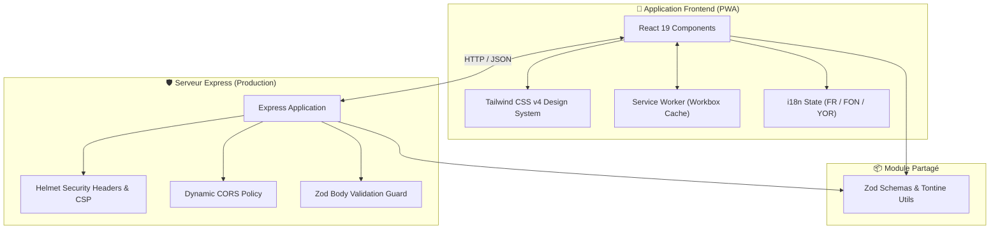

# 🏗️ Architecture Technique — TontineBJ

Ce document décrit l'architecture logicielle, les choix techniques et l'organisation du projet **TontineBJ**.

---

## 📐 Vue d'Ensemble de l'Architecture

TontineBJ repose sur une architecture découpée et moderne :
1. **Frontend PWA** (React 19 + TypeScript + Vite 7)
2. **Backend / Serveur Statique** (Node.js + Express)
3. **Logique Métier Partagée** (`shared/`)
4. **Intégrations Futures** (Mobile Money MTN/Moov, Passerelle USSD)



---

## 🎨 Design System & Direction Artistique

La direction artistique du projet est intitulée **« Carnet de Confiance »** (modernisme vernaculaire ouest-africain) :

- **Baobab Leaf (`#1E5B47`)** : Vert profond, couleur propriétaire rassurante.
- **Jaune Soleil (`#F3BF4B`)** : Énergie et notifications de versement.
- **Sable Chaud (`#F5F1E9`)** : Couleur de fond papier tactile.
- **DM Serif Display** : Typographie éditoriale pour les titres.
- **Manrope** : Typographie géométrique pour l'interface et les montants financiers en XOF.

---

## ⚡ Stratégie PWA & Cache Hors-ligne

Le projet est configuré via `@vite-plugin-pwa` et Workbox pour offrir un accès hors-ligne :

1. **App Shell Caching** : Mise en cache du HTML, CSS, JS et icônes SVG.
2. **Stratégie `NetworkFirst`** : Pour les appels d'API (`/api/*`) avec un timeout de 3 secondes avant bascule sur le cache.
3. **Stratégie `CacheFirst`** : Pour les polices, scripts, styles et images.
4. **Manifest Web App** : Défini dans `client/public/manifest.webmanifest` avec mode `standalone` et couleur de thème `#1e5b47`.

---

## 📦 Organisation du Code Source

```text
tontinebj-web/
├── client/                     # Code frontend React
│   ├── public/                 # Assets statiques PWA
│   └── src/
│       ├── components/         # Composants réutilisables (Radix UI, Map)
│       ├── contexts/           # Contexte de thème
│       ├── hooks/              # Custom React hooks (usePersistFn, etc.)
│       ├── pages/              # Pages principales (Home.tsx, NotFound.tsx)
│       └── lib/                # Fonctions d'assistance
├── server/                     # Code serveur Node.js / Express
│   ├── index.ts                # Point d'entrée serveur
│   └── security.ts             # Protection Helmet, CORS et Zod
├── shared/                     # Logique partagée frontend / backend
├── docs/                       # Documentation GitHub du projet
├── README.md                   # Présentation principale du projet
└── vite.config.ts              # Configuration Vite & Rollup
```
